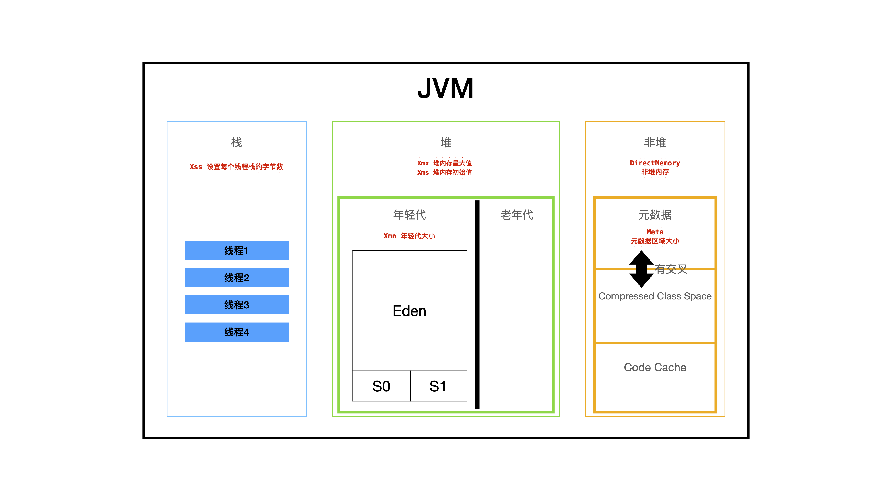

# Week01 作业
## Day1 作业
**1.（选做）自己写一个简单的Hello.java，里面需要涉及基本类型，四则运行，if和for，然后自己分析一下对应的字节码，有问题群里讨论。**

- Java 源代码
```Java
public class Hello {
    public static void main(String[] args) {
        int m = 0;
        int n = 9;
        for (int i = 0; i <= n; i++) {
            m += i;
        }
        double avg = m / n;
        double dx = n - avg;
        if (dx > 3.5) {
            double s2 = dx * dx;
        }
    }
}
```

- 字节码分析
``` 
Classfile /Users/Luyz/Documents/learn/geektime/JAVA-000/PlayGround/Hello.class
  Last modified 2020-10-16; size 459 bytes
  MD5 checksum 7458641119bf2e6f20377a269f629b66
public class Hello
  minor version: 0
  major version: 52
  flags: ACC_PUBLIC, ACC_SUPER
Constant pool:
   #1 = Methodref          #5.#24         // java/lang/Object."<init>":()V
   #2 = Double             3.5d
   #4 = Class              #25            // Hello
   #5 = Class              #26            // java/lang/Object
   #6 = Utf8               <init>
   #7 = Utf8               ()V
   #8 = Utf8               Code
   #9 = Utf8               LocalVariableTable
  #10 = Utf8               this
  #11 = Utf8               LHello;
  #12 = Utf8               main
  #13 = Utf8               ([Ljava/lang/String;)V
  #14 = Utf8               i
  #15 = Utf8               I
  #16 = Utf8               args
  #17 = Utf8               [Ljava/lang/String;
  #18 = Utf8               m
  #19 = Utf8               n
  #20 = Utf8               avg
  #21 = Utf8               D
  #22 = Utf8               dx
  #23 = Utf8               StackMapTable
  #24 = NameAndType        #6:#7          // "<init>":()V
  #25 = Utf8               Hello
  #26 = Utf8               java/lang/Object
{
  public Hello();
    descriptor: ()V
    flags: ACC_PUBLIC
    Code:
      stack=1, locals=1, args_size=1
         0: aload_0
         1: invokespecial #1                  // Method java/lang/Object."<init>":()V
         4: return
      LocalVariableTable:
        Start  Length  Slot  Name   Signature
            0       5     0  this   LHello;

  public static void main(java.lang.String[]);
    descriptor: ([Ljava/lang/String;)V
    flags: ACC_PUBLIC, ACC_STATIC
    Code:
      stack=4, locals=9, args_size=1
         0: iconst_0                        // 整型数字0 入栈
         1: istore_1                        // 初始化Slot1的值m，初始化的值为0
         2: bipush        9                 // 整型数字9 入栈
         4: istore_2                        // 初始化Slot2的值n，初始化的值为9
         5: iconst_0                        // 整型数字0 入栈
         6: istore_3                        // 初始化Slot3的值i，初始化的值为0，这个地方是不是把m和n的初始化语句反过来，会少一次字节码操作
         7: iload_3                         // 复制变量i(Slot3)入栈
         8: iload_2                         // 复制变量n(Slot2)入栈
         9: if_icmpgt     22                // i 大于 n 的时候，跳转到22行
        12: iload_1                         // 复制变量m(Slot1)入栈
        13: iload_3                         // 复制变量i(Slot3)入栈
        14: iadd                            // 栈顶两个元素出栈相加(整型）再入栈，m + i
        15: istore_1                        // 将结果保存到m(Slot1)
        16: iinc          3, 1              // 变量i(Slot3)整型增加1，
        19: goto          7                 // 跳转到第7行
        22: iload_1                         // 复制变量m(Slot1)入栈
        23: iload_2                         // 复制变量n(Slot2)入栈
        24: idiv                            // 栈顶两个元素出栈相除（整型） m/n，结果入栈
        25: i2d                             // 栈顶的整型变量转换为double
        26: dstore_3                        // double类型数字保存到Slot3的位置，avg
        27: iload_2                         // 复制变量n(Slot2)入栈
        28: i2d                             // 栈顶的整型变量转换为double
        29: dload_3                         // 复制变量avg(Slot3)入栈
        30: dsub                            // 栈顶两个元素出栈相减（double） n - avg，结果入栈
        31: dstore        5                 // double类型保存到（Slot5 dx）
        33: dload         5                 // 复制变量dx(Slot5)入栈
        35: ldc2_w        #2                // 加载一个double 3.5d的常量入栈
        38: dcmpl                           // 比较大小
        39: ifle          49                // 如果小于等于，则跳转到49行
        42: dload         5                 // 复制变量dx(Slot5)入栈
        44: dload         5                 // 复制变量dx(Slot5)入栈
        46: dmul                            // 栈顶两个元素出栈相乘（double） dx * dx，结果入栈
        47: dstore        7                 // double类型数字保存到Slot 7的位置 ？？？但是LocalVariableTable没有slot7？
        49: return                          // 程序结束
      LocalVariableTable:
        Start  Length  Slot  Name   Signature
            7      15     3     i   I
            0      50     0  args   [Ljava/lang/String;
            2      48     1     m   I
            5      45     2     n   I
           27      23     3   avg   D
           33      17     5    dx   D
      StackMapTable: number_of_entries = 3
        frame_type = 254 /* append */
          offset_delta = 7
          locals = [ int, int, int ]
        frame_type = 250 /* chop */
          offset_delta = 14
        frame_type = 253 /* append */
          offset_delta = 26
          locals = [ double, double ]
}

```
**2、（必做）自定义一个Classloader，加载一个Hello.xlass文件，执行hello方法，此文件内容是一个Hello.class文件所有字节(x=255-x)处理后的文件。文件群里提供。**

```Java
package luyz.geektime.java.jvm;

import java.io.File;
import java.io.FileInputStream;
import java.lang.reflect.InvocationTargetException;
import java.lang.reflect.Method;

/**
 * @author : Luyz
 * @date : 2020/10/21 01:28
 */
public class ReverseByteClassLoader extends ClassLoader{
    public static void main(String[] args) {
        try {
            Class<?> helloClass = new ReverseByteClassLoader().findClass("Hello");
            Object helloObject = helloClass.newInstance();
            Method helloMethod = helloClass.getMethod("hello");
            helloMethod.invoke(helloObject);
        } catch (ClassNotFoundException | IllegalAccessException | InstantiationException | NoSuchMethodException | InvocationTargetException e) {
            e.printStackTrace();
        }
    }

    @Override
    protected Class<?> findClass(String name) throws ClassNotFoundException {
        byte[] bytes = readClassFile(name);
        return defineClass(name,bytes,0,bytes.length);
    }

    private byte[] readClassFile(String name) throws ClassNotFoundException {
        byte[] classByte = new byte[0];
        File file = new File("/Users/Luyz/Documents/learn/geektime/JAVA-000/PlayGround/Hello/Hello.xlass");
        if (!file.exists()) {
            throw new ClassNotFoundException();
        }
        try {
            FileInputStream fileInputStream = new FileInputStream(file);
            byte[] buf = new byte[1024];
            int len = fileInputStream.read(buf);
            classByte = new byte[len];
            for (int i = 0; i < len; i++) {
                classByte[i] = (byte) (255 - buf[i]);
            }
        }
        catch(Exception e) {
            e.printStackTrace();
            throw new ClassNotFoundException();
        }
        return classByte;
    }
}

```

**3、（必做）画一张图，展示Xmx、Xms、Xmn、Meta、DirectMemory、Xss这些内存参数的关系。**




**4、（选做）检查一下自己维护的业务系统的JVM参数配置，用jstat和jstack、jmap查看一下详情，并且自己独立分析一下大概情况，思考有没有不合理的地方，如何改进。**

  本题目基于在测试服务器上新启动的测试服务进行检查。

- 使用``jstat -gcutil 13151 10000 1000``一段时间的结果
```
  S0     S1     E      O      M     CCS    YGC     YGCT    FGC    FGCT     GCT
  0.00   0.00  21.36  35.01  95.58  93.04     15    0.174     3    0.323    0.497
  0.00   0.00  21.86  35.01  95.58  93.04     15    0.174     3    0.323    0.497
  0.00   0.00  22.73  35.01  95.58  93.04     15    0.174     3    0.323    0.497
  0.00   0.00  24.66  35.01  95.58  93.04     15    0.174     3    0.323    0.497
  0.00   0.00  26.35  35.01  95.58  93.04     15    0.174     3    0.323    0.497
  0.00   0.00  38.27  35.01  95.58  93.04     15    0.174     3    0.323    0.497
  0.00   0.00  50.84  35.01  95.58  93.04     15    0.174     3    0.323    0.497
  0.00   0.00  58.72  35.01  95.58  93.04     15    0.174     3    0.323    0.497
  0.00   0.00  70.51  35.01  95.58  93.04     15    0.174     3    0.323    0.497
  0.00   0.00  85.51  35.01  95.58  93.04     15    0.174     3    0.323    0.497
  0.00   0.00  90.80  35.01  95.58  93.04     15    0.174     3    0.323    0.497
  0.00   0.00  93.44  35.01  95.58  93.04     15    0.174     3    0.323    0.497
  0.00   0.00  97.89  35.01  95.58  93.04     15    0.174     3    0.323    0.497
  0.00   0.00  99.45  35.01  95.58  93.04     15    0.174     3    0.323    0.497
  4.30   0.00   1.77  35.02  95.23  92.13     16    0.178     3    0.323    0.501
  4.30   0.00   5.02  35.02  95.23  92.13     16    0.178     3    0.323    0.501
  4.30   0.00   5.02  35.02  95.23  92.13     16    0.178     3    0.323    0.501
  4.30   0.00  11.22  35.02  95.23  92.13     16    0.178     3    0.323    0.501
  4.30   0.00  20.05  35.02  95.23  92.13     16    0.178     3    0.323    0.501
  4.30   0.00  20.05  35.02  95.23  92.13     16    0.178     3    0.323    0.501
``` 

- ``jstack`` 命令结果不太会看，看不清楚

- ``jmap -heap`` 命令结果
```
Attaching to process ID 13151, please wait...
Debugger attached successfully.
Server compiler detected.
JVM version is 25.262-b10

using thread-local object allocation.
Parallel GC with 2 thread(s)

Heap Configuration:
   MinHeapFreeRatio         = 0
   MaxHeapFreeRatio         = 100
   MaxHeapSize              = 994050048 (948.0MB)
   NewSize                  = 20971520 (20.0MB)
   MaxNewSize               = 331350016 (316.0MB)
   OldSize                  = 41943040 (40.0MB)
   NewRatio                 = 2
   SurvivorRatio            = 8
   MetaspaceSize            = 21807104 (20.796875MB)
   CompressedClassSpaceSize = 1073741824 (1024.0MB)
   MaxMetaspaceSize         = 17592186044415 MB
   G1HeapRegionSize         = 0 (0.0MB)

Heap Usage:
PS Young Generation
Eden Space:
   capacity = 314572800 (300.0MB)
   used     = 73744456 (70.32819366455078MB)
   free     = 240828344 (229.67180633544922MB)
   23.442731221516926% used
From Space:
   capacity = 8388608 (8.0MB)
   used     = 360448 (0.34375MB)
   free     = 8028160 (7.65625MB)
   4.296875% used
To Space:
   capacity = 8388608 (8.0MB)
   used     = 0 (0.0MB)
   free     = 8388608 (8.0MB)
   0.0% used
PS Old Generation
   capacity = 72876032 (69.5MB)
   used     = 25519488 (24.3372802734375MB)
   free     = 47356544 (45.1627197265625MB)
   35.017669458183455% used

26942 interned Strings occupying 2825992 bytes.
```

- ``jmap -histo pid | head -20`` 查看前20的情况
```
 num     #instances         #bytes  class name
----------------------------------------------
   1:        540578       39425520  [C
   2:         19589       23244832  [I
   3:         91954        8091952  java.lang.reflect.Method
   4:        268411        6441864  java.lang.String
   5:         44306        3218712  [B
   6:         77004        2996072  [Ljava.lang.Object;
   7:         50646        1620672  java.util.HashMap$Node
   8:         73227        1558504  [Ljava.lang.Class;
   9:         45817        1466144  java.util.concurrent.ConcurrentHashMap$Node
  10:         19992        1456488  [Ljava.util.HashMap$Node;
  11:         11221        1241336  java.lang.Class
  12:         21409        1027632  java.util.HashMap
  13:         41130         987120  java.lang.StringBuilder
  14:         30834         986688  org.apache.ibatis.reflection.property.PropertyTokenizer
  15:         21215         848600  java.util.LinkedHashMap$Entry
  16:         19360         774400  java.math.BigDecimal
  17:          7236         694656  sun.util.calendar.Gregorian$Date
```

## Day2 作业

**1. (选做)本机使用 G1 GC 启动一个程序，仿照课上案例分析一下 JVM 情况**

- 启动命令
```
java -XX:+UseG1GC -XX:MaxGCPauseMillis=50 -jar xxl-job-admin-2.0.2-SNAPSHOT.jar
```
- ``jmap -heap``
```
Attaching to process ID 63036, please wait...
Debugger attached successfully.
Server compiler detected.
JVM version is 25.92-b14

using thread-local object allocation.
Garbage-First (G1) GC with 8 thread(s)

Heap Configuration:
   MinHeapFreeRatio         = 40
   MaxHeapFreeRatio         = 70
   MaxHeapSize              = 4294967296 (4096.0MB)
   NewSize                  = 1363144 (1.2999954223632812MB)
   MaxNewSize               = 2576351232 (2457.0MB)
   OldSize                  = 5452592 (5.1999969482421875MB)
   NewRatio                 = 2
   SurvivorRatio            = 8
   MetaspaceSize            = 21807104 (20.796875MB)
   CompressedClassSpaceSize = 1073741824 (1024.0MB)
   MaxMetaspaceSize         = 17592186044415 MB
   G1HeapRegionSize         = 1048576 (1.0MB)

Heap Usage:
G1 Heap:
   regions  = 4096
   capacity = 4294967296 (4096.0MB)
   used     = 105381880 (100.49999237060547MB)
   free     = 4189585416 (3995.5000076293945MB)
   2.453613094985485% used
G1 Young Generation:
Eden Space:
   regions  = 66
   capacity = 156237824 (149.0MB)
   used     = 69206016 (66.0MB)
   free     = 87031808 (83.0MB)
   44.29530201342282% used
Survivor Space:
   regions  = 12
   capacity = 12582912 (12.0MB)
   used     = 12582912 (12.0MB)
   free     = 0 (0.0MB)
   100.0% used
G1 Old Generation:
   regions  = 23
   capacity = 99614720 (95.0MB)
   used     = 23592952 (22.49999237060547MB)
   free     = 76021768 (72.50000762939453MB)
   23.684202495374176% used

22775 interned Strings occupying 2751728 bytes.
```


系统内存16G，默认分配了四分之一的堆内存空间，4G，每个G1区域的大小为1M
Eden区域占66块，Survivor区12块，老年代23块


- ``jstat -gcutil`` 抽取了部分结果行
```
 S0     S1     E      O      M     CCS    YGC     YGCT    FGC    FGCT     GCT
0.00 100.00  44.97  23.68  98.08  95.79     14    0.132     0    0.000    0.132
0.00 100.00  29.73  23.68  98.09  96.91     15    0.143     0    0.000    0.143
0.00 100.00  50.68  23.68  98.09  96.91     15    0.143     0    0.000    0.143
```
15次GC，共耗时143ms，平均每次GC 14.3ms