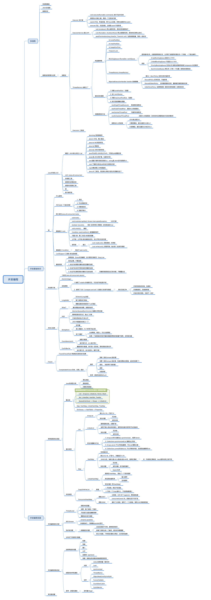

# Week03 作业
## Day7 作业
**1、(选做)把示例代码，运行一遍，思考课上相关的问题。也可以做一些比较。**
- ``Semaphore`` 信号量
SemaphoreDemo3里面有这么一个设置
```Java
// 非空锁
final Semaphore notEmpty = new Semaphore(0);
// 核心锁
final Semaphore mutex = new Semaphore(1);
```
这边的意思是一开始是锁的，必须放进去了之后，notEmpty释放过一次之后，才能再释放是么？
那这是不是意味着，这个初始化的permits并非上限而是当前可用的数量，在某些情况下，可以不require，直接release(n),增加n个可用的数量啊。

- ``CompletableFuture`` 
对于 ``CompletableFuture``的多种操作，感觉和RxJS很类似。

**2、(必做)思考有多少种方式，在main函数启动一个新线程，运行一个方法，拿到这个方法的返回值后，退出主线程?写出你的方法，越多越好，提交到github。**

- 要求：
    1. 不能执行不完，要执行结束线程
    2. 线程要退出去 

[完整作业代码](./Homework03.java)

1. FutureTask 直接使用new Thread创建线程运行，主要代码：
```Java
FiboThread fiboThread = new FiboThread();
FutureTask<Integer> fiboTask = new FutureTask<>(fiboThread);
try {
    new Thread(fiboTask).start();
    result = fiboTask.get();
} catch (InterruptedException e) {
    e.printStackTrace();
} catch (ExecutionException e) {
    e.printStackTrace();
}

static class FiboThread implements Callable<Integer> {
    @Override
    public Integer call() throws Exception {
        return sum();
    }
}
```

2. 创建线程池来执行，主要代码：
```Java
FiboThread fiboThread = new FiboThread();
ExecutorService executorService = Executors.newSingleThreadExecutor();
try {
    result = executorService.submit(fiboThread).get();
    executorService.shutdown();
} catch (InterruptedException e) {
    e.printStackTrace();
} catch (ExecutionException e) {
    e.printStackTrace();
}

static class FiboThread implements Callable<Integer> {
    @Override
    public Integer call() throws Exception {
        return sum();
    }
}
```
3. Semaphore 通过信号量来获取执行状态
```Java
Semaphore semaphore = new Semaphore(0);
FiboCounterSemaphore counter = new FiboCounterSemaphore(semaphore);
counter.start();
try {
    semaphore.acquire();
    result = counter.getResult();
} catch (InterruptedException e) {
    e.printStackTrace();
}

static class FiboCounterSemaphore extends Thread {
    private Semaphore semaphore;
    private int result = 0;

    public FiboCounterSemaphore(Semaphore semaphore) {
        this.semaphore = semaphore;
    }

    @Override
    public void run() {
        result = sum();
        semaphore.release();   // 在子线程里控制释放资源占用
    }

    public int getResult() {
        return result;
    }
}
```

4. CountDownLatch 控制
```Java
CountDownLatch countDownLatch = new CountDownLatch(1);
FiboCounterCountDownLatch counter = new FiboCounterCountDownLatch(countDownLatch);
counter.start();
try {
    countDownLatch.await();
    result = counter.getResult();
} catch (InterruptedException e) {
    e.printStackTrace();
}


static class FiboCounterCountDownLatch extends Thread {
    private CountDownLatch countDownLatch;
    private int result = 0;

    public FiboCounterCountDownLatch(CountDownLatch countDownLatch) {
        this.countDownLatch = countDownLatch;
    }

    @Override
    public void run() {
        result = sum();
        countDownLatch.countDown();
    }

    public int getResult() {
        return result;
    }
}
```

4. CyclicBarrier 控制
```Java
ExecutorService executorService = Executors.newSingleThreadExecutor();
CyclicBarrier cyclicBarrier = new CyclicBarrier(1, new Runnable() {
    @Override
    public void run() {
        executorService.shutdown();
    }
});
FiboCounterCyclicBarrier counter = new FiboCounterCyclicBarrier(cyclicBarrier);
executorService.submit(counter);
while (!executorService.isTerminated()) {

}
result = counter.getResult();


static class FiboCounterCyclicBarrier implements Runnable {
    private CyclicBarrier cyclicBarrier;
    private int result = 0;

    public FiboCounterCyclicBarrier(CyclicBarrier cyclicBarrier) {
        this.cyclicBarrier = cyclicBarrier;
    }

    @Override
    public void run() {
        result = sum();
        try {
            cyclicBarrier.await();
        } catch (InterruptedException e) {
            e.printStackTrace();
        } catch (BrokenBarrierException e) {
            e.printStackTrace();
        }
    }

    public int getResult() {
        return result;
    }
}
```

## Day8 作业
**1、(选做)列举常用的并发操作API和工具类，简单分析其使用场景和优缺点。**  
：P (暂略)

**2、(选做)请思考:什么是并发?什么是高并发?实现高并发高可用系统需要考虑哪 些因素，对于这些你是怎么理解的?**  

字面意义上来说，并发就是同时进行，即多个线程同时处理任务。  
我个人理解，高并发指的是同时处理的任务，远大于CPU核数对于每个应用来说。


高并发高可用的系统设计，首先业务系统是服务于具体业务的，首先要考虑当前的业务量及未来的发展趋势；其次考虑业务场景，梳理业务流程，将业务流程按性质或者处理能力拆分为细粒度，处理好关键环节的并发。  

对于并发来说，我把它分为两种：一种业务并发，也就是设计时业务本身就是一个高并发的状态，比如双十一抢购、春节抢票这种行为，同时有海量用户在进行业务操作。另一种是应用并发，本身业务不是一个强并发的业务，只是相关的业务容易同时进入系统，比如每天收盘时，可能平台有多个股票交易策略在运行或者业务系统导入的大量数据，本身这些业务并非需要同时完成。对于前一种业务，做负载、横向扩展硬件来处理，对于后一种，通过MQ之类的中间件来限流和削峰处理。


**3、(选做)请思考:还有哪些跟并发类似/有关的场景和问题，有哪些可以借鉴的解决 办法。**
1. 最早的火车站，一边是车站大楼，这边几个股道，进站出战的人，都要跨过股道走到大楼来操作。火车进站和出战的时候，旅客是在股道上不安全，在火车进站和出站的时候人不能进站出站。
2. 后来修了地下通道，进站出站的人可以走地下通道，此时火车进站出站不影响旅客进出，但是同时只能放一班车，否则可能会有人走错口上错站台
3. 现在的部分高铁站都是立体结构，火车道在一层，候车室检票在2层，每个站台都有单独的检票口和楼梯，多班列车多个站台同时检票放人，不会互相影响，但每两个站台之间共享一个通道，在一侧站台检票的时候，另一侧站台是锁的。

> 感觉2->3算是一个并发问题，1->2算是多线程资源分配，火车和旅客共享站台的资源，拆分开之后各看各的，互不影响。

**4、(必做)把多线程和并发相关知识带你梳理一遍，画一个脑图，截图上传到github 上。可选工具:xmind，百度脑图，wps，MindManage，或其他。**
