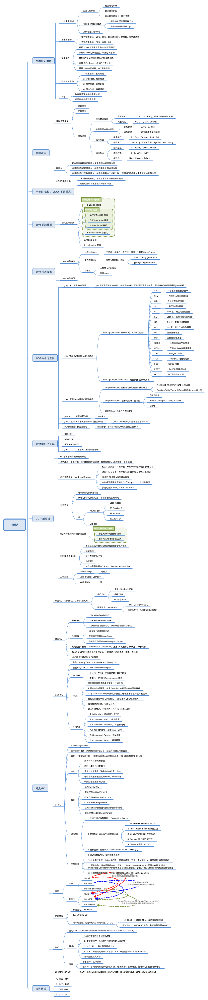
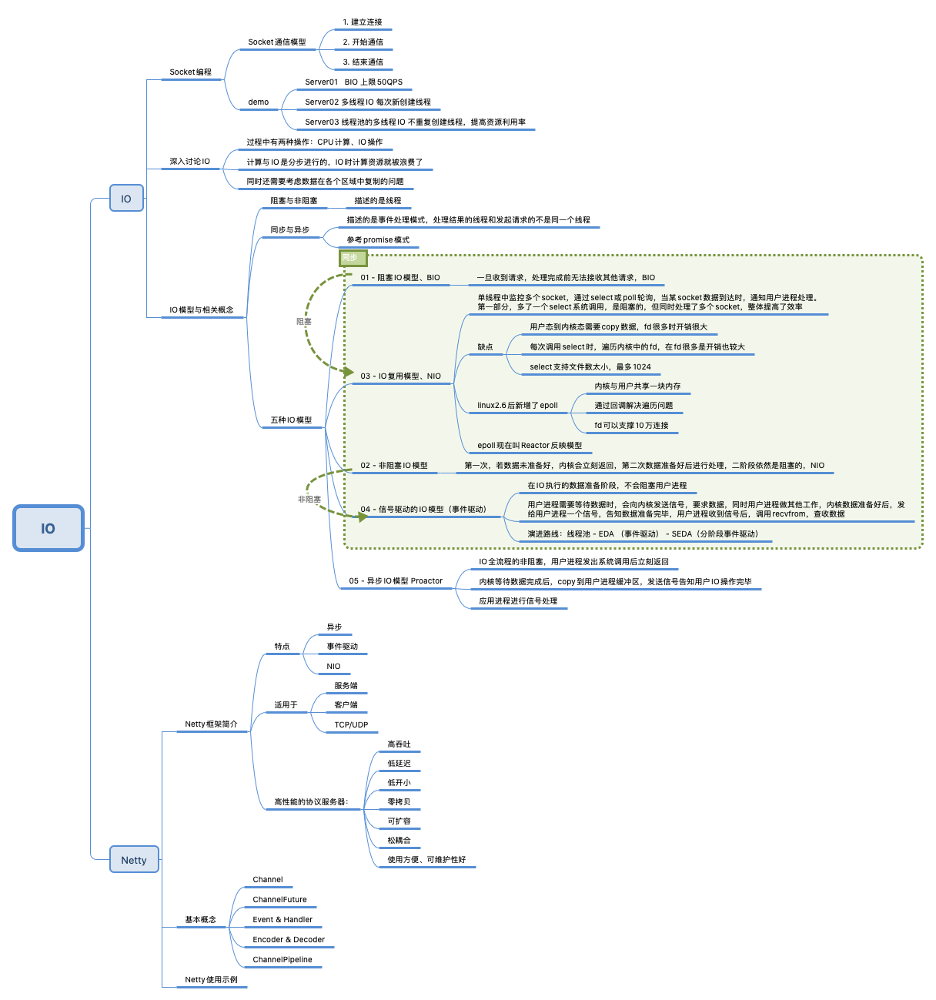
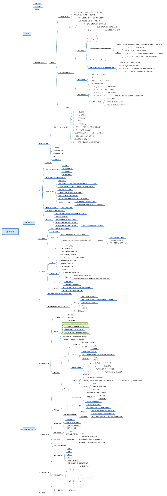
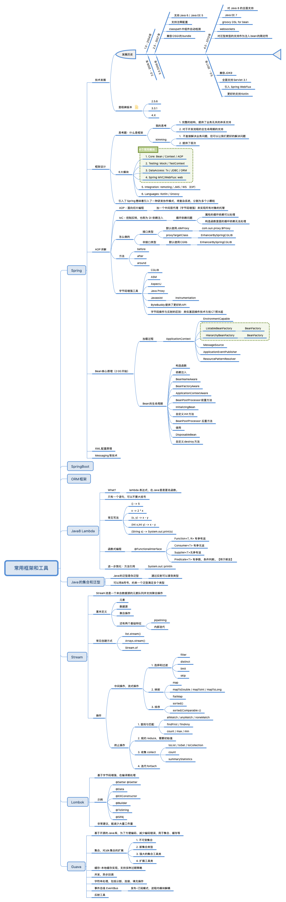
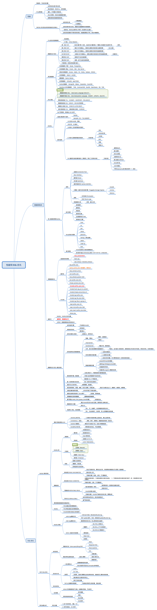
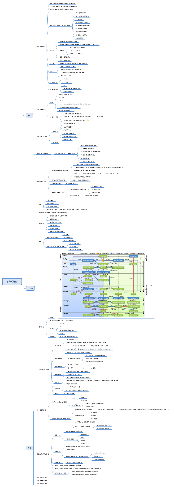

# 毕业项目

## (必做)分别用 100 个字以上的一段话，加上一幅图 (架构图或脑图)，总结自己对下列技术的关键点思考和经验认识:
1. JVM
> 对于Java开发来说，JVM是其运行的基础，所有的Java相关皆构建于其基础上，学习JVM能使我们更了解熟悉这套系统是如何运作的。JVM知识能帮助我们对异常情况进行排查，也能帮助我们对运行时进行优化。这部分的重点，我认为首先是如何使用各种工具来进行JVM问题诊断和调优，其次是了解熟悉各个GC的差别，针对业务进行优化，最后是字节码相关的知识。我认为不掌握JVM依然可以做一个优秀的Java开发，但依然值得学习和投入时间去了解。JVM相关知识对我来说重要程度6分（10分满分）。

2. NIO
> IO是系统性能的关键因素之一，IO模型的演进是提高有限资源的利用率的过程，这个思路可以在很多地方借鉴。线程的阻塞和非阻塞、事件的同步和异步，将处理模式分为多个方式。高性能的模式根据同步、异步分为Reactor模型和Proactor模型，了解熟悉这两个模型的设计是这部分比较重要的内容。NIO相关知识对我来说重要程度8分（10分满分）。

3. 并发编程
> 当前的应用设计必须要考虑并发问题，尤其是在互联网领域。对于传统行业的业务应用开发，也不能不考虑并发的影响。一方面来说并发问题增加了应用开发的复杂度，需要考虑如何控制相关资源的冲突问题，另一方面，并发也能带来程序性能的大量提升。目前还是在传统行业从事开发工作，并发的场景并没有特别复杂。学习时在思考互联网的分布式应用应该如何考虑，希望以后有机会能再多接触了解相关的内容。这部分的重点，首先是各种形式的锁以及锁的使用场景，其次是各种并发工具类。并发编程相关知识对我来说重要程度7分（10分满分）。

4. Spring 和 ORM 等框架
> Spring是当前Java业务开发的事实标准，基本上是个绕不开的话题，通过了解Spring的一些实现远离，能了解如何更好的使用Spring甚至更好的使用Java。之前一直没了解过Spring的历史，经过课程的学习，感觉这就是一个农民起义的过程，不满与大厂或者是说当时的商业软件对环境的垄断，便自己实现了一个。“屠龙者终成恶龙”，最终Spring变成了所有Java开发者要击败的恶龙。（前面跑偏了）ORM框架，mybatis和hibernate各有千秋，我之前参与的项目两类框架都有用到，对于基本查询两种语言差别不大，复杂查询各有各自的实现方式。Lombok日常也在用，Guava之前用的比较少，通过这次学习，开始尝试在项目中用到其中的一些工具。这部分知识基本全部需要掌握，优先肯定是Spring和两大ORM框架，其次是各种工具类。这部分知识对我来说重要程度10分，必须要了解和掌握的（10分满分）。

>`` TODO: 这部分课程笔记没做全，后续重新看一遍的时候再补齐``

5. MySQL 数据库和 SQL
> 数据是业务的基础，业务系统的运行是建立在一条条的数据之上的，无论是Oracle、SQL Server还是MySQL，数据库是开发必须要掌握的能力。数据库从使用到设计，再到优化，都是需要了解熟悉和掌握的。之前在工作中，这部分内容相对参与的较少，基本是基于oracle开发，mysql和相关优化经验不是很多，基本都是在做简单的CURD和一些小的事务，通过学习了解熟悉了很多数据库实现方面的知识。这部分知识的重点，对我来说首先是慢SQL排查和优化（我印象秦老师说过，业务系统90%还是多少来着，都是慢在SQL查询上），其次是MySQL的锁和隔离级别相关的内容。这部分知识对我来说重要程度8分，基础知识必须要掌握，一些优化和排查方式推荐学习了解（10分满分）。

6. 分库分表
> **这部分内容没认真学，后续会补一下的。** 这部分内容基本是面向大型互联网应用或者数据量比较大的应用，针对海量数据来进行的分库分表操作，一个是能提高性能，另外还可用分库分表来进行数据冗余备份之类的操作。我实际工作中基本没有相关的场景，但是基于脑补互联网应用的场景，还是可以理解这部分内容的。分库分表也是由于业务规模扩张而演进出来的工具。课上用Apache的开源项目ShardingSphere来进行了实际的讲解和演示，这部分作业也没认真做、课也听的断断续续，所以目前还没有相关的脑图和总结，后续完成复习后再进行补充。
> TODO: !!!

7. RPC 和微服务
> 只要涉及到多系统交互，就无法避免RPC，我个人理解，RPC就像是两个人对话，对于异构系统，需要各自封装成一套标准的体系，就像两个互相不懂对方语言的人，都将自己的语言翻译为英语给对方，比如封装为REST服务，直接语言无关了。对于使用相同语言相同框架来说，会更容易调用一些，性能更好，类似两个老乡说话，可以直接说家乡话，都容易理解对方说的什么。微服务是业务语义，是在基于RPC技术的情况下，将系统按照业务进行拆分，每个拆分出来的子系统都是一个业务单元。而将业务进行微服务化的过程中，需要对服务进行全面的管控，又由此引出了一系列相关的工具，如服务注册、发现、集群、路由等内容。这部分感觉都是重点，无论是什么样的系统，都离不开这些内容。这部分内容重要程度9分。

``这部分的脑图没记全，后续再进行补充``

8. 分布式缓存
> 缓存是提高系统性能的一个关键中间件，从计算机原理来说，CPU需要读取数据来进行操作，读取速度的快慢依次是L1、L2缓存，内存，硬盘这样。类似的对于我们业务系统，常用数据存储在缓存中，效率要优于每次都去数据库读取。缓存又分为本地缓存和分布式缓存，在目前环境下，分布式缓存一般指的都是Redis相关技术。Redis部署和使用有多种模式，在实际使用中，需要注意主从模式、集群模式的应用。在Java环境中，也有多个Redis相关的工具，之前对Jedis比较熟。同时使用了缓存之后，就会有对应的问题，典型的问题有缓存穿透、缓存击穿、缓存雪崩，需要了解对应的解决方案。本部分内容的重点，一个是redis的部署，一个是相关框架的使用，还有就是常见问题。本部分内容较为常用，还是比较重要的，需要有一定的了解和认识，评分8分。

``TODO: 暂时没做脑图，后续补充``

9. 分布式消息队列
> TODO: 翘课了，还没补完，TAT，春节期间补完

``TODO: 同暂时没做脑图，后续补充``

---

## 毕业总结

很庆幸自己当时决定报0期的Java培训班，秦老师知识的广度和深度使的这个课物超所值，更别说除了技术之外，对职业发展相关的内容也进行了多方面的指导，同时极客时间团队的崔崔老师和爽爽班主任，也对整个教学过程提供了足够多的支持，另外还有助教老师们，每周批改作业，在群里答疑，带着大家做开源，这些都是在报名前没想到的。  
对于我来说，报这个班的主要目的是，对整个Java关键技术的有体系化认知和了解。非科班出身，应用数学专业教一部分相关课程，但基本都是浅尝辄止。工作后基本都是面线需求编程，用到什么学什么，没用过没学过的就不太了解。尽管也一直有关注业内的技术趋势，但都是零散的知识内容，没能成为体系。19年开始带小团队，本身技术能力就不全面，所以迫切的需要对Java相关的有一个整体的了解。所以本次课程对于我来说，完全满足了我的需要，并且有了更多意想之外的收货。
十五周的时间说过就过，感觉太快了，由于工作和家庭的原因，最后几节课一直没能补上，计划在春节假期内补完整，但整个课程的知识，远非15周能了解和掌握的，对我来说，预计需要一年以上的时间去学习和提炼。同时在跟着课程的过程中，基本每周只做了必做题，也是同样计划在补学的过程中，把选做题和挑战题也尝试一下。学习这个过程是个长期的事情，看一遍、做一遍、讲一遍对知识的理解是不同的角度。
还有一个遗憾就是想尝试一下开源，但一直没能挤出来时间，21年给自己定的目标里面添加了这一项，争取下半年能规划一下时间，拿一部分时间来开始尝试一下开源。
    